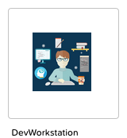
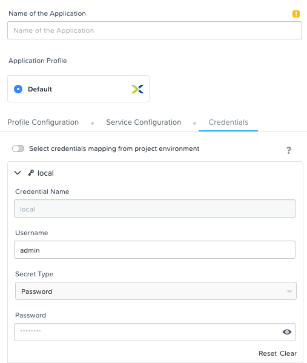
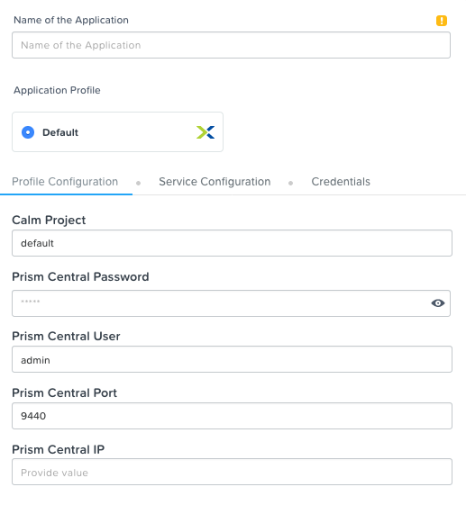
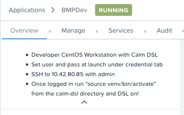
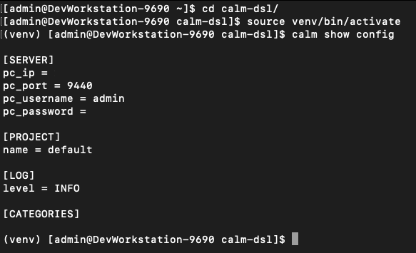
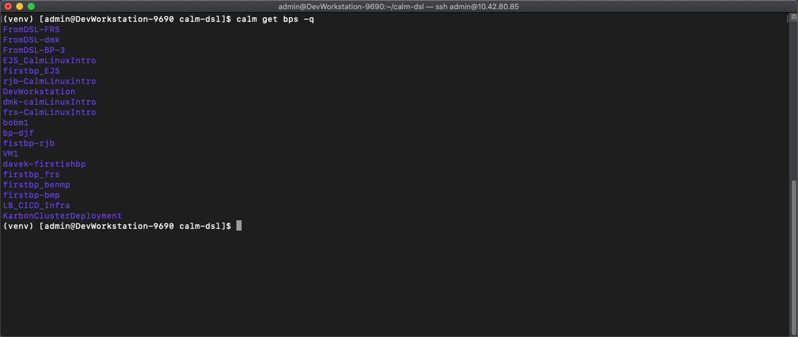

## Launch DevWorkstation from Calm Marketplace



-   **Important: Select the Credentials tab and enter desired User/Pass**



-   Enter the name of Application "DevWorkstation-\<INITIALS\> and fill out the form with the requested information



-   Press Create

-   While waiting review the audit log to see packages being deployed.  The blueprint automatically installs several utilities along with Calm DSL

## Once the application is "running" SSH to the DevWorkstation

-   The IP address of the DevWorkstation is listed under the application overview.  The SSH user/pass is what was set under the credentials tab




## Start the virtual environment and connect to Prism Central

-   cd to the "calm-dsl" directory from home

-   Run ```source venv/bin/activate``` to switch to the virtual environment. This will enable the virtual environment for Calm DSL

-   **Optional:** This has been done automatically through the blueprint launch. Once you SSH into the DevWorkstation we can setup the connection to Prism Central by running ```calm init dsl```. 

-   Verify the current config settings by running ```calm show config``` 




## List the current blueprints in Calm

-   Run ```calm get bps``` and we see all the blueprints in Calm with their UUID, description, application count, project, and state


-   Run ```calm get bps -q``` to display quiet output with only the BP names




## Review python based blueprint and make a modification

-   Change to the "HelloBlueprint" directory and run ```ls```

    -   This directory and it's contents were automatically created during the blueprint launch.  As part of the DevWorkstation blueprint launch we ran ```calm init bp``` which creates a sample blueprint configured with the connected Calm instance

-   There is a file called "blueprint.py" which is a python version of a blueprint

-   There is a "scripts" directory. This is where the bash/powershell/python scripts are stored that are referenced within the blueprint

{width="6.111805555555556in"
height="1.7902099737532808in"}

-   Run ```vi blueprint.py```

-   Review the blueprint for familiar constructs.  To skip directly to a line enter ```:<linenumber>```

    -   Credentials (line 54-69)

    -   OS Image (line 62-65)

    -   Under class HelloPackage(Package) you will see references to the scripts in the script directory (line 139)

    -   Basic VM spec information (vCPU/memory/nics) (line 153-159)

    -   Guest Customization contains cloud-init (line 161)

-   In the blueprint.py modify the number of vCPU

    -   Change the vCPU from 2 to 4 (line 154)

{width="6.5in"
height="1.1340277777777779in"}

-   Add a unique VM name using a macro (line 185)

    -   provider\_spec.name = \"\<Initials\>-@@{calm\_unique}@@\"

{width="6.525223097112861in"
height="0.7223665791776028in"}

-   Write/quit ```:wq``` the .py blueprint file to save and close

## Modify pkg\_install\_task.sh

-   Change to the scripts directory and run ```ls```. We will see 2 scripts that are being referenced inside the .py blueprint file

-   Run ```more pkg_install_task.sh``` to view the current contents of the
    install script.  What does this script do?

-   Run ```curl -Sks https://raw.githubusercontent.com/bmp-ntnx/prep/master/nginx > pkg_install_task.sh``` to replace the install script

-   Run ```more pkg_install_task.sh``` to view the changed script.  What does the script do now?

{width="6.5in" height="1.03125in"}

## Sync the modified .py blueprint to Calm

-   Return to the "HelloBlueprint" directory

-   Run ```calm create bp --file blueprint.py --name FromDSL-<Initials>```

    -   This converts the .py file to json an sync it with Calm

-   Optional: Run ```calm compile bp -f blueprint.py``` to view the json format from DSL

{width="6.5in"
height="0.8729166666666667in"}

-   Verify your new blueprint by running ```calm get bps -q```

{width="5.67132874015748in"
height="2.4833333333333334in"}

## Take the blueprint and launch into an application

-   Run ```calm get apps``` to verify all the current applications before
    launching your new app

    -   You can also run ```calm get apps -q``` to quiet the details like we did with blueprints earlier

{width="6.5in"
height="2.6881944444444446in"}

-   Next launch your newly uploaded blueprint into an application

-   Run ```calm launch bp <blueprint_name> --app_name AppFromDSL-<Initials> -i```

{width="6.5in"
height="2.3027777777777776in"}

-   Run ```calm describe app AppFromDSL-<Initials>``` to see the application summary

{width="6.5in"
height="3.9097222222222223in"}

-   Once the app status changes to "running" we will have a nginx server deployed from Calm DSL!

## Log into Prism Central to verify

-   We can see the blueprint created from DSL

-   We can see the application launched from DSL

    -   On the application tab created from DSL select the "Services" tab and copy the IP

{width="6.5in"
height="1.3416666666666666in"}

-   Enter the IP in a web browser and this will take you to the nginx **"Welcome to DSL"** web page

{width="6.5in" height="3.8625in"}
